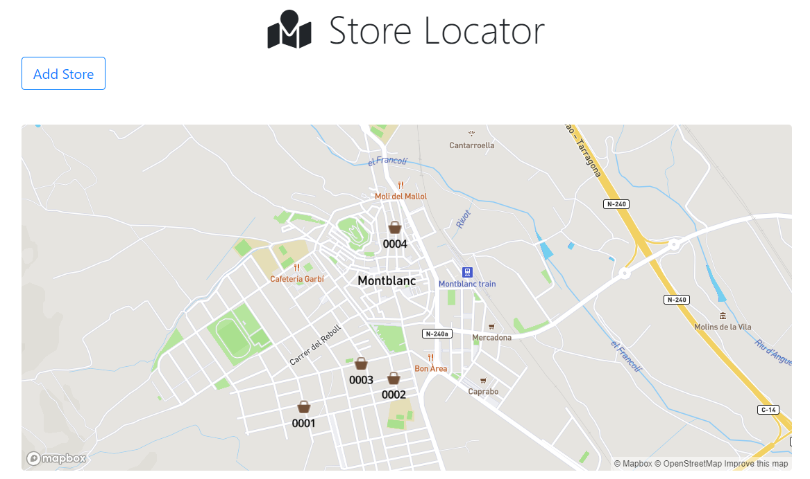
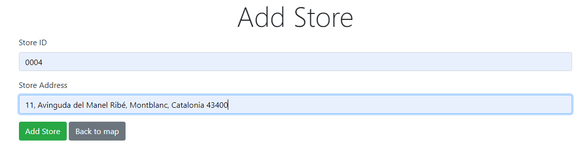

# Store Locator

> Node/Express/Mongo/Mongoose/Geocoder//Mapbox/Bootstrap API with GeoJSON location field for store locations. 

## Quick Start

Add your MONGO_URI and GEOCODER_API_KEY to the "config/config.env" file.

```bash
# Install dependencies
npm install

# Serve on localhost:5000
npm run dev (nodemon)
or
npm start

# Routes
GET    /api/v1/stores # Get Stores

POST   /api/v1/stores # Add Store
body { storeId: "0001", address: "10, Carrer de Sant Joan, Montblanc, Catalonia 43400, ES" }
```

## Map with the stores


## Adding new stores

